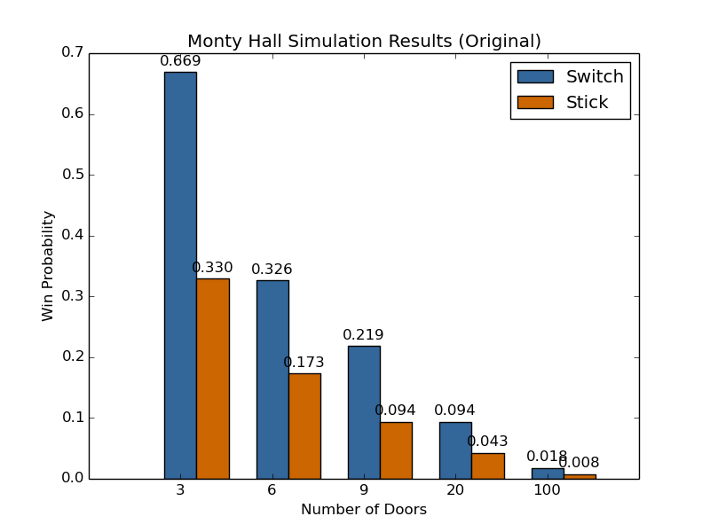
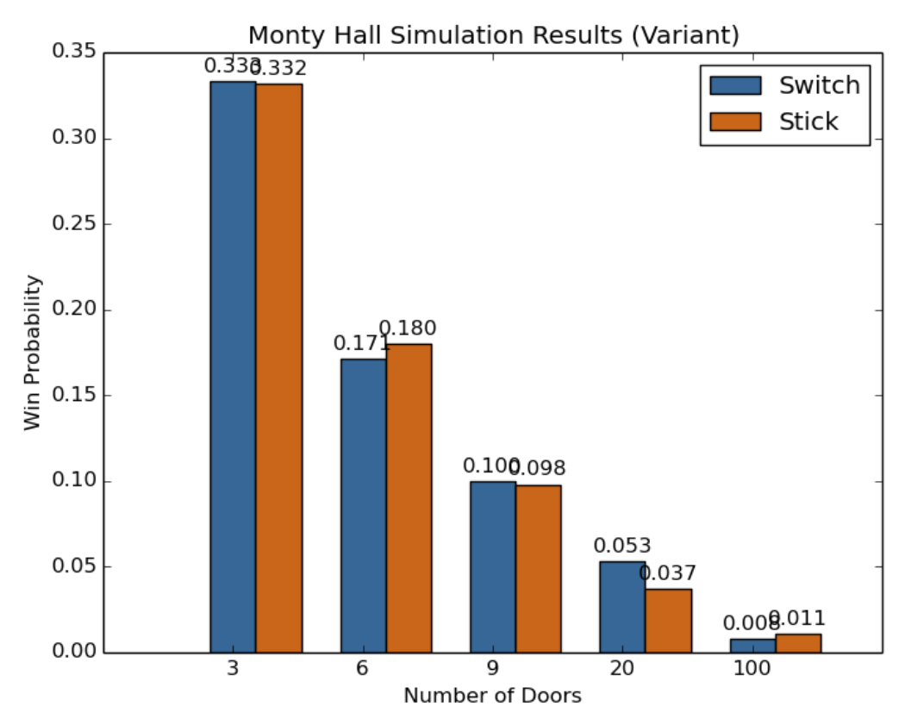

# CSCI 154 Project: Monty Hall

A Monte Carlo simulation is employed, consisting of 1000 iterations, to evaluate the best strategy for winning the Monty Hall problem under various conditions.
The simulation evaluates the performance of both the "stick" and "switch" strategies under two versions of the Monty Hall problem: 
* the original version where the host will only open a door that is neither the player’s selection or a winning door
* the variant version where the host will only open a non-player-selected door 
  * If the host opens the winning door, the game ends and is counted as a loss to the player.

## Result Diagrams
Host only opens a single door during each iteration of the program.

### Original Monty Hall

### Variant Monty Hall

